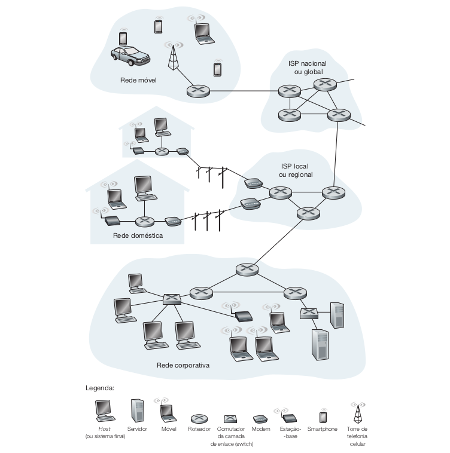
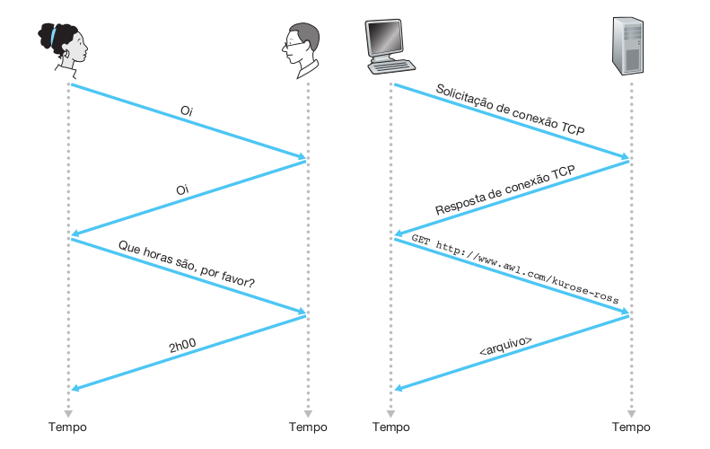
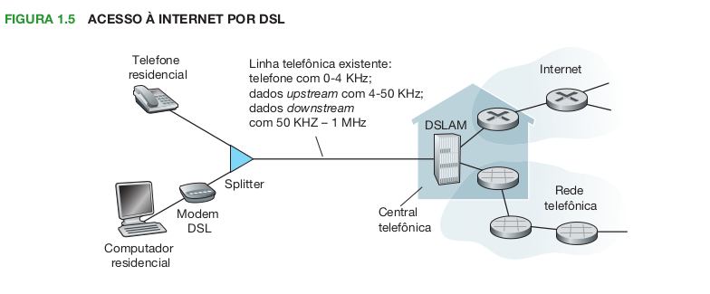
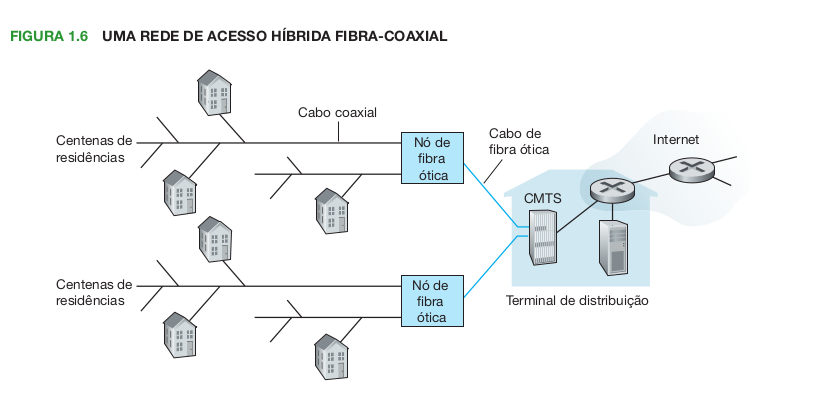
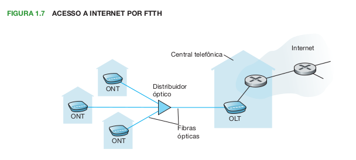
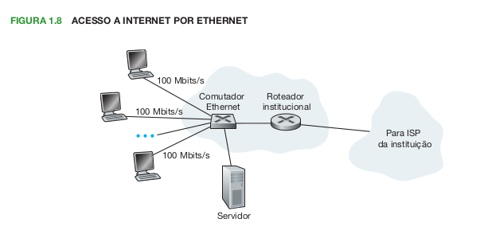
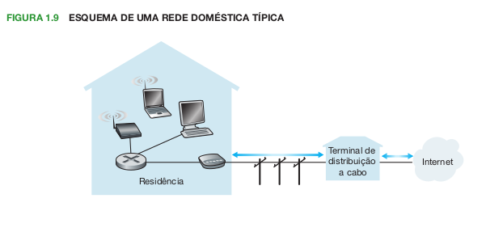
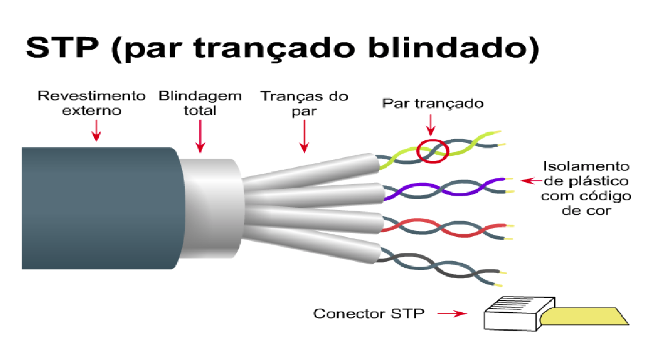

# 1 Redes de Computadores e a Internet

## 1.1 O que é a Internet?
A Internet é uma rede de computadores que interconecta centenas de milhões de dispositivos de compu­
tação ao redor do mundo. Para ser explicada, ela pode ser dividida. Um é o aspecto de hardware e software, a outra é sobre o serviço que ela oferece. Vamos inicar falando sobre o primeiro aspecto.

### 1.1.1 Componentes da rede
A internet é formada por uma série de componentes distintos, com funções diferentes mas que conseguem se comunicar e trafegar informação. Abaixo uma lista com diversos integrantes da internet.

* __Hospedeiros ou sistemas finais__: computadores, laptops, smartphones, televisores, webcams, carros e diversos outros componentes são considerados host ou sistemas finais. 

* __Enlaces (links) de comunicação__: é o meio por onde as informações travegam de um lugar para outro da rede. Eles dividem-se entre cabeados ou sem fio.

* __Taxa de transmissão__: é a quantidade de bits por segundo que um link consegue transmitir.

* __Pacotes__: são as informações dividas em pedaços. Cada pacote tem um cabeçalho para auxiliar na hora de juntar os pacotes e reconstruir a informação para o usuário final.

* __Roteadores e comutadores de camada de enlace__: são dispositivos responsáveis por direcionar os pacotes. Os comutadores de enlace geralmente são utilizados em redes de acesso, enquanto os roteadores são utilizados no núcleo da rede.

* __Rota__: É o caminho que pacote faz para ir de um sistema final até outro sistema final.

* __Provedores de Serviços de Internet (*ISPs*)__: são o meio por onde os sistemas finais tem acesso a Internet. Os ISPs são formadas por comutadores de pacotes e enlaces de comunicação. Os ISPs podem fornecer diversos tipos de acesso à rede, variando o meio e a velocidade. ISPs também fornecem acesso a provedores de conteúdo, conectando sites diretamente à Internet. Os ISPs podem ser dividos em níveis de acordo com seu alcance. Um ISP de nível mais alto consiste em roteadores de alta velocidade interconectados com enlaces de fibra ótica de alta velocidade. Cada rede ISP, seja de nível mais alto ou mais baixo, é gerenciada de forma independente, executa o protocolo IP e obedece a certas convenções de nomeação e endereço.

* __Protocolos__: é a "lingua" que os componentes da Internet utilizam para poder se comunicar. Os dois principais protocolos são __TCP__ (__Transmission Control Protocol__ — Protocolo de Controle de Transmissão) e o __IP__ (__Internet Protocol__ — Protocolo da Internet). O protocolo IP especifica o formato dos pacotes que são enviados e recebidos entre roteadores e sistemas finais.

* __Padrões da Internet__: são os padrões que definem como os protocolos são implementados. Eles são feitos pela __IETF__ (__Internet Engineering Task Force__ — Força de Trabalho de Engenharia da Internet). Os padrões são publicados em forma de __RFCs__ (__Request For Comments__ — pedido de comentários). Outros órgãos também especificam padrões para componentes de rede, principalmente para enlaces. O IEEE 802 LAN/MAN Standards Committee [IEEE 802, 2009], por exemplo, especifica os padrões Ethernet e Wi-Fi sem fio. 

## 1.1.2 Uma descrição do serviço

No seção anterior vimos a parte dos componentes da internet. Agora falaremos de outro aspecto, a parte dos serviços. Toda uma infraestrutura que fornece serviços à aplicações. As aplicações são as mais diversas, desde e-mails, streamings de video/música, geolocalização, compartilhamento de arquivos, login remoto e mais. Todas essas aplicações são conhecidas como __aplicações distruibuídas__, pois envolvem diversos sistemas finais que trocam informações mutuamente. De forma geral, as aplicações da Internet são executadas em hosts e não em comutadores de pacote no núcleo da rede. Porém como os sistemas finais conversam entre si para poder dar vida as aplicações?

Os sistemas finais ligados à Internet oferecem uma __Interface de Programação de Aplicação__ (__API__) que especifica como o programa que é executado no sistema final solicita à infraestrutura da Internet que envie dados
a um programa de destino específico, executado em outro sistema final. Essa API da Internet é um conjunto de
regras que o software emissor deve cumprir para que a Internet seja capaz de enviar os dados ao programa de
destino.

Suponha que Alice queria enviar uma carta para Bob
utilizando o serviço postal. Alice, é claro, não pode apenas escrever a carta (os dados) e atirá-la pela janela. Em vez disso, o serviço postal necessita que ela coloque a carta em um envelope; escreva o nome completo de
Bob, endereço e CEP no centro do envelope; feche; coloque um selo no canto superior direito; e, por fim, leve
o envelope a uma agência de correio oficial. Dessa maneira, o serviço postal possui sua própria “API de serviço
postal”, ou conjunto de regras, que Alice deve cumprir para que sua carta seja entregue a Bob. De um modo se-
melhante, a Internet possui uma API que o software emissor de dados deve seguir para que a Internet envie os
dados para o software receptor.

## 1.1.3 O que é um protocolo?

Protocolo é o conjunto das informações, decisões, normas e regras definidas a partir de um ato oficial, como audiência conferência ou negociação, por exemplo.

Na realidade, a palavra “protocolo” abrange um leque de significados extenso, podendo variar desde um conjunto de formalidades públicas até os critérios a serem cumpridos no detrimento de determinada atividade, por exemplo.

A comunicação humana é um exemplo de onde há protocolo. Caso se cumpra as regras, é possivel manter um dialogo e trocar informações.

### Protocolos de Rede 

Um protocolo de rede é semelhante a um protocolo humano; a única diferença é que as entidades que trocam mensagens e realizam ações são componentes de hardware ou software de algum dispositivo (por exemplo, computador, smartphone, tablet, roteador ou outro equipamento habilitado para rede). Todas as atividades na Internet que envolvem duas ou mais entidades remotas comunicantes são governadas por um protocolo.

Por fim, pode-se dizer que um __protocolo__ define o formato e a ordem das mensagens trocadas entre duas ou mais entidades comunicantes, bem como as ações realizadas na transmissão e/ou no recebimento de uma mensagem ou outro evento.

## 1.2 A periferia da Internet

Nesta seção, começamos pela periferia de uma rede e examinaremos os componentes com os quais estamos mais familiarizados, como computadores, smartphones e outros equipamentos que usamos diariamente. Os sistemas finais da Internet incluem computadores de mesa, servidores e computadores móveis. Além disso, diversos aparelhos alternativos estão sendo utilizados com a Internet como sistemas finais. 

Sistemas finais também são denominados hospedeiros porque hospedam programas de aplicação, tais como um navegador da Web, um programa servidor da Web, um programa leitor de
e-mail ou um servidor de e-mail. 

### 1.2.1 Redes de acesso

### Acesso doméstico: DSL, cabo, FTTH, discado e satélite

As redes de acesso são a rede física que conecta um sistema final ao primeiro roteador de um caminho partindo de um sistema final até outro qualquer. Lista com as redes de acesso mais comuns para residencias:

* __Linha digital de assinante (DSL)__: Normalmente uma residência obtém acesso DSL à Internet da mesma empresa que fornece acesso telefônico local com fio (por exemplo, a operadora local). Assim, quando a DSL é utilizada, uma operadora do cliente é também seu provedor de serviços de Internet (ISP). O modem DSL de cada cliente utiliza a linha telefônica existente para trocar dados com um multiplexador digital de acesso à linha do assinante (DSLAM), em geral localizado na CT da operadora.  O modem DSL da casa apanha dados digitais e os traduz para sons de alta frequência, para transmissão pelos fios de telefone até a CT; os sinais analógicos de muitas dessas residências são traduzidos de volta para o formato digital no DSLAM. A linha telefônica conduz, simultaneamente, dados e sinais telefônicos tradicionais, que são codificados em frequências diferentes:
  * um canal _downstream_ de alta velocidade, com uma banda de 50 kHz a 1 MHZ; 
  * um canal _upstream_ de velocidade média, com uma banda de 4 kHz a 50 kHz; 
  * um canal de telefone bidirecional comum, com uma banda de 0 a 4 kHz;
  
  Essa abordagem faz que a conexão DSL pareça três conexões distintas, de modo que um telefonema e a conexão com a Internet podem compartilhar a DSL ao mesmo tempo. Do lado do consumidor, para os sinais que chegam até sua casa, um distribuidor separa os dados e os sinais telefônicos e conduz o sinal com os dados para o modem DSL. Na operadora, na CT, o DSLAM separa os dados e os sinais telefônicos e envia aqueles para a Internet. Centenas ou mesmo milhares de residências se conectam a um único DSLAM.

  Os padrões DSL definem taxas de transmissão de 12 Mbits/s downstream e 1,8 Mbits/s upstream [ITU, 1999] e 24 Mbits/s downstream e 2,5 Mbits/s upstream [ITU, 2003]. Em razão de as taxas de transmissão e recebimento serem diferentes, o acesso é conhecido como assimétrico. As taxas reais alcançadas podem ser menores do que as indicadas anteriormente, pois o provedor de DSL pode, de modo proposital, limitar uma taxa residencial quando é oferecido o serviço em camadas (diferentes taxas, disponíveis a diferentes preços), ou porque a taxa máxima pode ser limitada pela distância entre a residência e a CT, pela bitola da linha de par trançado e pelo grau de interferência elétrica. Os engenheiros projetaram o DSL expressamente para distâncias curtas entre a residência e a CT; quase sempre, se a residência não estiver localizada dentro de 8 a 16 quilômetros da CT, ela precisa recorrer a uma forma de acesso alternativa à Internet.

  

* __acesso à Internet a cabo (HFC)__: as fibras óticas conectam o terminal de distribuição às junções da região, sendo o cabo coaxial tradicional utilizado para chegar às casas e apartamentos de maneira individual. Cada junção costuma suportar de 500 a 5.000 casas. Em razão de a fibra e o cabo coaxial fazerem parte desse sistema, a rede é denominada híbrida fibra-coaxial (HFC).  O acesso à Internet a cabo necessita de modems especiais, denominados modems a cabo. O modem a cabo é, em geral, um aparelho externo que se conecta ao computador residencial pela porta Ethernet. No terminal de distribuição, o sistema de término do modem a cabo (CMTS) tem uma função semelhante à do DSLAM da rede DSL — transformar o sinal analógico enviado dos modems a cabo de muitas residências downstream para o formato digital. Os modems a cabo dividem a rede HFC em dois canais, um de transmissão (downstream) e um de recebimento (upstream). Como a tecnologia DSL, o acesso costuma ser assimétrico, com o canal downstream maior do que a do canal upstream.
  * um canal _upstream_ de velocidade média, com uma banda de 30,7 Mbits/s; 
  * um canal _downstream_ de velocidade média, com uma banda de 42,8 Mbits/s;

  Uma característica importante do acesso a cabo é o fato de ser um meio de transmissão compartilhado. O que pode levar a uma lentidão em horários de grande pico de consumo.

  

* __fiber to the home (FTTH)__: o conceito da FTTH é simples — oferece um caminho de fibra ótica da CT diretamente até a residência. Cada residência possui um terminal de rede ótica (ONT), que é conectado por uma fibra ótica dedicada a um distribuidor da região. O distribuidor combina certo número de residências (em geral menos de 100) a uma única fibra ótica compartilhada, que se liga a um terminal de linha ótica (OLT) na CT da operadora. O OLT, que fornece conversão entre sinais ópticos e elétricos, se conecta à Internet por meio de um roteador da operadora. Na residência, o usuário conecta ao ONT um roteador residencial (quase sempre sem fio) pelo qual acessa a Internet. Na arquitetura de PON, todos os pacotes enviados do OLT ao distribuidor são nele replicados (semelhante ao terminal de distribuição a cabo). A FTTH consegue potencialmente oferecer taxas de acesso à Internet na faixa de gigabits por segundo, porém, a maioria dos provedores de FTTH oferece diferentes taxas, das quais as mais altas custam muito mais.

* __Discado e satélite__: O acesso discado por linhas telefônicas tradicionais é baseado no mesmo
modelo do DSL — um modem doméstico se conecta por uma linha telefônica a um modem no ISP. Em com-
paração com DSL e outras redes de acesso de banda larga, o acesso discado é terrivelmente lento em 56 kbits/s.
  Em locais onde DSL, cabo e FTTH não estão disponíveis (por exemplo, em algumas propriedades rurais), um enlace de satélite pode ser empregado para conexão em velocidades não maiores do que 1 Mbit/s; StarBand e HughesNet são dois desses provedores de acesso por satélite

### Acesso na empresa (e na residência): Ethernet e Wi-Fi

* __Ethernet__: os usuários utilizam um par de fios de cobre trançado para se conectarem a um comutador Ethernet. O comutador Ethernet, ou uma rede desses comutadores interconectados, é por sua vez conectado à Internet maior. Com o acesso por uma rede Ethernet, os usuários normalmente têm acesso de 100 Mbits/s com o comutador Ethernet, enquanto os servidores possuem um acesso de 1 Gbit/s ou até mesmo 10 Gbits/s.

;

* __Wifi__: Em uma LAN sem fio, os usuários transmitem/recebem pacotes para/de um ponto de acesso que está conectado à rede da empresa (quase sempre incluindo Ethernet com fio) que, por sua vez, é conectada à Internet com fio. Um usuário de LAN sem fio deve estar no espaço de alguns metros do ponto de acesso. Hoje a LAN sem fio baseado na tecnologia IEEE 802.11, fornece uma taxa de transmissão compartilhada de até 54 Mbits/s.

### Acesso sem fio em longa distância: 3G e LTE

* __3G__: O 3G emprega a mesma infraestrutura sem fios usada para a telefonia celular para enviar/receber pacotes por uma estação-base que é controlada pela operadora da rede celular. Diferente do Wi-Fi, um usuário só precisa estar dentro de algumas dezenas de quilômetros (ao contrário de algumas dezenas de metros) da estação-base. As empresas de telecomunicação têm investido enormemente na assim chamada terceira geração (3G) sem fio, que oferece acesso remoto à Internet por pacotes comutados a velocidades que ultrapassam 1 Mbit/s. Inclusive existem evoluções como o 4G e 5G.

 * __LTE__: LTE (de “Long­‐Term Evolution”) tem suas raízes na tecnologia 3G, e tem potencial para alcançar velocidades superiores a 10 Mbits/s. Taxas downstream LTE de muitas dezenas de Mbits/s foram relatadas em implementações comerciais.

### 1.2.2 Meios físicos

O meio físico são por onde os bits/pacotes são transmitidos de um sistema final para outro. Eles podem ser classificados em duas categorias: meios guiados e meios não guiados. Nos meios guiados, as ondas são dirigidas ao longo de um meio sólido, tal como um cabo de fibra ótica, um par de fios de cobre trançado ou um cabo coaxial. Nos meios não guiados, as ondas se propagam na atmosfera e no espaço, como é o caso de uma LAN sem fio ou de um canal digital de satélite. Abaixo uma lista com os principais meios físicos utilizados nos enlaces:

* __Par de fios de cobre trançado__: constituído de dois fios de cobre isolados, cada um com cerca de um milímetro de espessura, enrolados em espiral. Os fios são trançados para reduzir a interferência elétrica de pares semelhantes que estejam próximos. Normalmente, uma série de pares é conjugada dentro de um cabo, isolando-se os pares com blindagem de proteção. Um par de fios constitui um único enlace de comunicação. O par trançado sem blindagem (unshielded twisted pair — UTP) costuma ser usado em redes de computadores de edifícios, isto é, em LANs. Hoje, as taxas de transmissão de dados para as LANs de pares trançados estão na faixa de 10 Mbits/s a 10 Gbits/s. As taxas de transmissão de dados que podem ser alcançadas dependem da bitola do fio e da distância entre transmissor e receptor.

* __Cabo coaxial__: é constituído de dois condutores de cobre, porém concêntricos e não paralelos. Com essa configuração, isolamento e blindagem especiais, pode alcançar taxas altas de transmissão de dados. O cabo coaxial pode ser utilizado como um meio compartilhado guiado. Vários sistemas finais podem ser conectados diretamente ao cabo, e todos eles recebem qualquer sinal que seja enviado pelos outros sistemas finais.

* __Fibras ópticas__: A fibra ótica é um meio delgado e flexível que conduz pulsos de luz, cada um deles representando um bit. Uma única fibra ótica pode suportar taxas de transmissão elevadíssimas, de até dezenas ou mesmo centenas de gigabits por segundo. Fibras óticas são imunes à interferência eletromagnética, têm baixíssima atenuação de sinal até cem quilômetros e são muito difíceis de derivar. Essas características fizeram da fibra ótica o meio preferido para a transmissão guiada de grande alcance, em especial para cabos submarinos.  Hoje, muitas redes telefônicas de longa distância dos Estados Unidos e de outros países usam exclusivamente fibras óticas, que também predominam no backbone da Internet. Contudo, o alto custo de equipamentos ópticos — como transmissores, receptores e comutadores — vem impedindo sua utilização para transporte a curta distância, como em LANs ou em redes de acesso residenciais. As velocidades de conexão do padrão Optical Carrier (OC) variam de 51,8 Mbits/s a 39,8 Gbits/s;

* __Canais de rádio terrestres__: Canais de rádio carregam sinais dentro do espectro eletromagnético. São um meio atraente porque sua instalação não requer cabos físicos, podem atravessar paredes, dão conectividade ao usuário móvel e, potencialmente, conseguem transmitir um sinal a longas distâncias. As características de um canal de rádio dependem muito do ambiente de propagação e da distância pela qual o sinal deve ser transmitido.  Condições ambientais determinam perda de sinal no caminho e atenuação por efeito de sombra (que reduz a intensidade do sinal quando­ ele transita por distâncias longas e ao redor/através de objetos interferentes), atenuação por caminhos múltiplos (devido à reflexão do sinal quando atinge objetos interferentes) e interferência (por outras transmissões ou sinais eletromagnéticos).  Canais de rádio terrestres podem ser classificados, de modo geral, em três grupos: os que operam sobre distâncias muito curtas (por exemplo, com um ou dois metros); os de pequeno alcance, que funcionam em locais próximos, normalmente abrangendo de dez a algumas centenas de metros, e os de longo alcance, que abrangem dezenas de quilômetros.

* __Canais de rádio por satélite__: Um satélite de comunicação liga dois ou mais transmissores-receptores de micro-ondas baseados na Terra,denominados estações terrestres. Ele recebe transmissões em uma faixa de frequência, gera novamente o sinalusando um repetidor e o transmite em outra frequência. Dois tipos de satélites são usados para comunicações: satélites geoestacionários e satélites de órbita baixa (LEO).

   * _satélites geoestacionários_: ficam de modo permanente sobre o mesmo lugar da Terra. Essa presença estacionária é conseguida colocando-se o satélite em órbita a 36 mil quilômetros acima da superfície terrestre. Essa enorme distância da estação terrestre ao satélite e de seu caminho de volta à estação terrestre traz um substancial atraso de propagação de sinal de 280 milissegundos. Mesmo assim, enlaces por satélite, que podem funcionar a v ­ elocidades de centenas de Mbits/s, são frequentemente usados em áreas sem acesso à Internet baseado em DSL ou cabo.

   * _satélites de órbita baixa (LEO)_: Os satélites de órbita baixa são posicionados muito mais próximos da Terra e não ficam sempre sobre um único lugar. Eles giram ao redor da Terra (exatamente como a Lua) e podem se comunicar uns com os outros e com estações terrestres. Para prover cobertura contínua em determinada área, é preciso colocar muitos satélites em órbita. Hoje, existem muitos sistemas de comunicação de baixa altitude em desenvolvimento.
