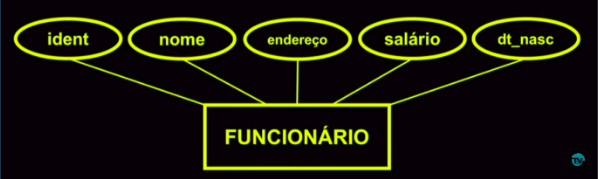
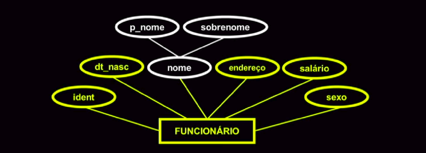
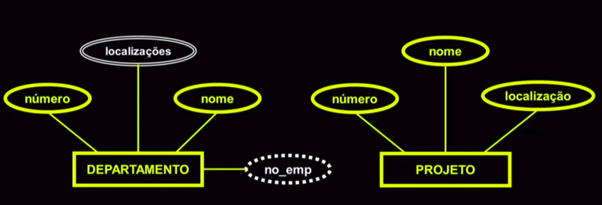
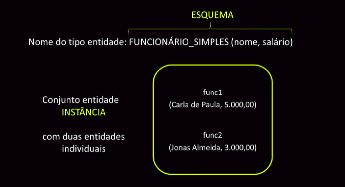
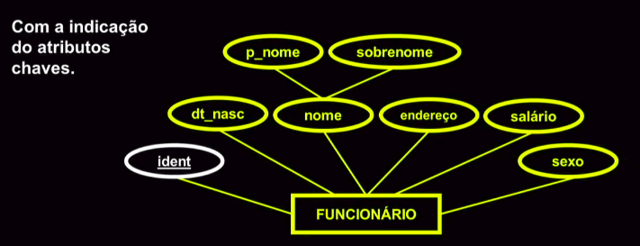
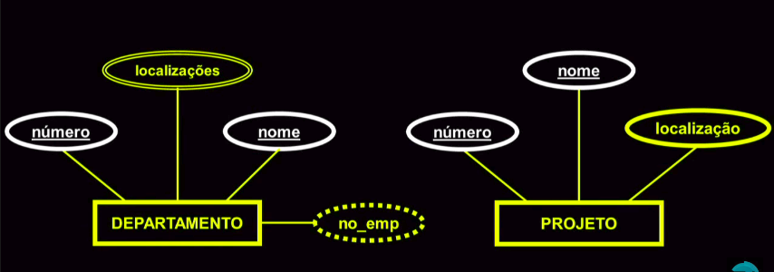
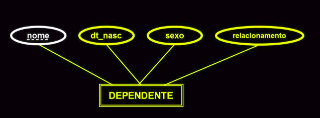

# Modelo Entidade Relacionamento

## Introdução

O modelo relacional é um modelo de dados representativo, que se baseia no princípio de que todos os dados estão armazenados em tabelas (ou, matematicamente falando, relações). O modelo relacional para gerência de bases de dados (SGBD) é um modelo de dados baseado em lógica e na teoria de conjuntos. Em definição simplificada, o modelo baseia-se em dois conceitos: conceito de __entidade__ e __relação__ - Uma __entidade__ é um elemento caracterizado pelos dados que são recolhidos na sua identificação vulgarmente designado por tabela. Na construção da tabela identificam-se os dados da entidade. A atribuição de valores a uma entidade constrói um registro da tabela. A __relação__ determina o modo como cada registro de cada tabela se associa a registros de outras tabelas.

## Entidade

As entidades podem ser dividas em duas: entidades __fortes__ ou __fracas__. Uma entidade __forte__ é um objeto básico do MER usado para representar uma _coisa_ no mundo real, física ou conceitual, com existência independente. Se tal existência só faz sentido quando está relacionada a outra entidade, é dita entidade __fraca__.

Usando como exemplo uma empresa, são identificadas as entidades:

## Atributos

__Atributo__ é uma propriedade que descreve uma entidade. Exemplo: Um funcionário possui um __número__ que o identifica (identidade), __nome__, __endereço__, __salário__ e __data de nascimento__.

No diagrama Entidade-Relacionamento, os atributos são representados por __elipses__.

Os atributos são encontrados em diversos tipos, esses são:
* simples ou compostos;
* univalorados ou multivalorados;
* armazenados ou derivados;

No exemplo abaixo podemos identificar atributos simples e compostos. Os simples são os amarelos e os compostos são os brancos. Podemos identificar que o atributo _nome_ é composto por _p_nome_ e _sobrenome_.

Já no exemplos abaixo podemos identificar atributos multivalorados e derivados. A elipse branca indica que os valores de localizações podem ser mais de um, mostrando que o departamento pode estar em mais de um lugar. 

A elipse tracejada significa que o valor desse atributo é derivado. Ele é gerado a partir de outros valores/dados que estão armazenados no Banco de Dados. Por ser um valor derivado, ele não precisa ser persistido, pois o valor pode ser gerado a partir de uma função.

Para exemplicar o que é uma entidade fraca, podemos ver o exemplo abaixo. Essa entidade só faz sentido existir se houver uma outra entidade chamada Funcionário.

### Conceitos Importantes

* Esquema: um tipo de entidade que define uma colução, ou conjunto, de entidades que têm os mesmos atributos.
* Intância: a coleção de todas as entidades de um tipo entidade é chamada de conjunto entidade

## Chaves

Uma entidade, geralmente, tem um ou mais atributos que assumem valores distintos para cada entidade individual dentro do conjunto entidade. Esse atributo, ou conjunto de atributos (chave composta), identifica unicamente uma entidade. Esses atributos tem uma __Restrição de unicidade__, a qual proíbe que duas entidades, em um mesmo conjunto entidade, tenham os mesmo valores no seu atributo chave. Essa chaves são comumente conhecidas como chaves primárias.

O exemplo abaixo mostra o atributo chave de funcionário

Já aqui mostra os atributos chaves de Departamento e de Projeto. Isso significa que nenhum Departamento/Projeto pode ter o nome ou número igual ao outro Departamento/Projeto na mesma empresa.

Nesse é mostrado uma entidade fraca. A sua chave identificadora é chamada de __chave parcial__ pois sozinho ele não identifica a entidade. Para isso ele precisa da entidade que ele faz relação. No exemplo, os dependentes são identificados pelo nome a partir de qual funcionário eles fazem parte.

## Relacionamentos

## Cardinalidades